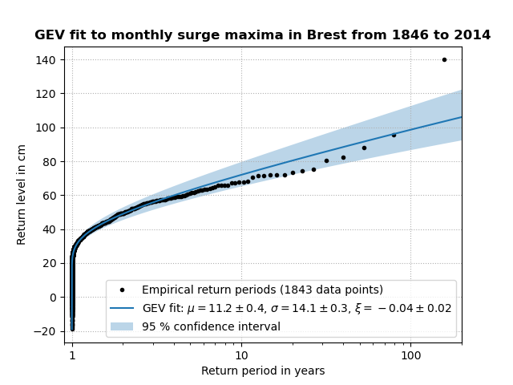

# ExtremeSurgeAnalysis

Statistical extreme value analysis of storm surge levels with Python.

## Reference

This repository contains the code to the peer-reviewed article:

Markus Reinert, Lucia Pineau-Guillou, Nicolas Raillard, & Bertrand
Chapron (2021). **Seasonal shift in storm surges at Brest revealed by
extreme value analysis.** *Journal of Geophysical Research: Oceans,*
126, e2021JC017794.
[DOI: 10.1029/2021JC017794](https://doi.org/10.1029/2021JC017794)

When using the code in this repository, please cite this paper.

Every version (or “Release”) of this code has an individual DOI.
Please also cite the DOI of the version you use.  You find the DOIs to
all versions by clicking on the DOI badge above.  This badge always
redirects to the latest code version.

## Description

The data used in the paper cannot be published here for
copyright reasons and needs to be obtained separately.  The surge
levels at Brest can be computed from the tide gauge measurements
published on the website https://data.shom.fr/, using the method
described by Reinert *et al.* (2021), or can be obtained from the corresponding
author upon request.  The GESLA-2 surge dataset of Woodworth et
al. (2017) can be obtained from the website https://gesla.org/, as
explained in [tools_GESLA.py](tools_GESLA.py).  The climate index data
(for example NAO) can be obtained from
https://psl.noaa.gov/gcos_wgsp/Timeseries/, as explained in
[tools_climate.py](tools_climate.py).

Given the datasets, the main results of the paper can be reproduced
with the scripts for [Method 1](Method_1_sliding_window_analysis.py),
[Method 2](Method_2_monthly_analysis.py), and
[different stations](Result_winter_shift_in_different_stations.py).
The parameter estimates of the full time-dependent GEV model can be
calculated with the script
[Time-dependent_GEV_fit_with_NAO.py](Time-dependent_GEV_fit_with_NAO.py).

The functions and methods in this repository can also be used with other
datasets or for other studies.  In particular,
the script [advanced_GEV_analysis.py](advanced_GEV_analysis.py) may be
useful.  Its main part is an implementation of the methods described in
the book “An Introduction to Statistical Modeling of Extreme Values” by
Stuart Coles (2001).  Example usage of this library is shown for
[time-independent GEV models](Time-independent_GEV_fit.py), for
[time-dependent GEV models](Time-dependent_GEV_fit.py), and for
[GEV models of annual maxima](Time-independent_GEV_fit_for_annual_maxima.py).
With the surge levels for Brest from the GESLA-2 dataset, the
time-independent GEV model of monthly maxima looks like this:

## Publications

Here is a list of publications using the code of this repository.
If any publications are missing, please let me know.

1. Markus Reinert, Lucia Pineau-Guillou, Nicolas Raillard, & Bertrand Chapron (2021).
*Seasonal shift in storm surges at Brest revealed by extreme value analysis.*
Journal of Geophysical Research: Oceans.
[DOI: 10.1029/2021JC017794](https://doi.org/10.1029/2021JC017794)

2. Jean-Baptiste Roustan, Lucia Pineau-Guillou, Bertrand Chapron, Nicolas Raillard, & Markus Reinert (2022).
*Shift of the storm surge season in Europe due to climate variability.*
Scientific Reports.
[DOI: 10.1038/s41598-022-12356-5](https://doi.org/10.1038/s41598-022-12356-5)

3. Kiesel, J., Lorenz, M., König, M., Gräwe, U., & Vafeidis, A. T. (2023).
*Regional assessment of extreme sea levels and associated coastal flooding along the German Baltic Sea coast.*
Natural Hazards and Earth System Sciences.
[DOI: 10.5194/nhess-23-2961-2023](https://doi.org/10.5194/nhess-23-2961-2023)
