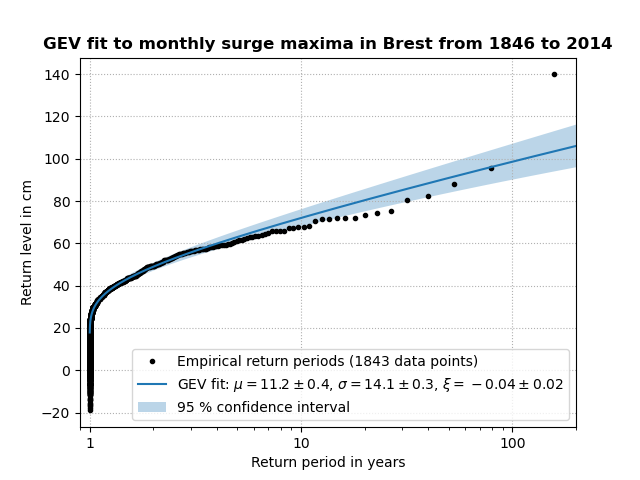

# ExtremeSurgeAnalysis
Statistical extreme value analysis of storm surge levels with Python.

This repository contains the code belonging to a submitted manuscript by
Markus Reinert *et al.* (2021).  The reference to the paper will be
added here as soon as it is published.  When you use the code in this
repository, please cite our paper and include the reference to it.

Note that the data used in the manuscript cannot be published here for
copyright reasons and needs to be obtained separately.  The surge
dataset of the authors can be obtained from the corresponding author
upon request.  The GESLA-2 surge dataset of Woodworth et al. (2017) can
be obtained from the website https://gesla.org/, as explained in
[tools_GESLA.py](tools_GESLA.py).  The climate index data (for example
NAO) can be obtained from https://psl.noaa.gov/gcos_wgsp/Timeseries/, as
explained in [tools_climate.py](tools_climate.py).

Given the datasets, the main results of the manuscript can be reproduced
with the scripts of [Method 1](Method_1_sliding_window_analysis.py) and
[Method 2](Method_2_monthly_analysis.py).  The analysis presented in the
Discussion can be reproduced with the
[Outlook script](Outlook_winter_shift_in_other_stations.py).
The parameter estimates of the full time-dependent GEV model can be
calculated with the script
[Time-dependent_GEV_fit_with_NAO.py](Time-dependent_GEV_fit_with_NAO.py).

The functions and methods in this repository can also be used with other
datasets, for related analyses, or in similar studies.  In particular,
the script [advanced_GEV_analysis.py](advanced_GEV_analysis.py) may be
useful.  Its main part is an implementation of the methods described in
the book “An Introduction to Statistical Modeling of Extreme Values” by
Stuart Coles (2001).  Example usage of this library is shown for
[time-independent GEV models](Time-independent_GEV_fit.py) and for
[time-dependent GEV models](Time-dependent_GEV_fit.py).  With the surge
levels for Brest from the GESLA-2 dataset, the time-independent GEV
model looks like this:

